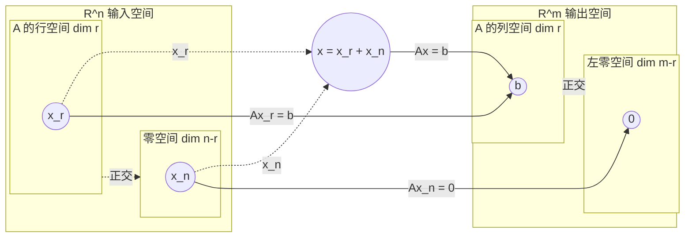

<!--more-->

---
E.g.

$$
A=\begin{pmatrix}
1 & 1 & 4 \\
5 & 1 & 4
\end{pmatrix}
$$
$$
U=\begin{pmatrix}
1 & 1 & 4 \\
0 & -4 & -16
\end{pmatrix}
$$
$$
RREF=\begin{pmatrix}
1 & 0 & 0 \\
0 & 1 & 4
\end{pmatrix}
$$

### C(AT)
取RREF的非零行，即C(AT)=(1,0,0)T,(0,1,4)T，dim C(AT)=r(A)=2。 
### N(A)
解Rx=0，取自由变量的向量，即 

$$
Rx=\begin{pmatrix}
1 & 0 & 0 \\
0 & 1 & 4
\end{pmatrix}
\begin{pmatrix}
x_1 \\
x_2 \\
x_3
\end{pmatrix}=0
$$

解得

$$
x=x_3\begin{pmatrix}
0 \\
-4 \\
1
\end{pmatrix}
$$

即N(A)=(0,-4,1)T，dim N(A)=1。 
### C(A)
取A中与RREF主元列相同的列，即 
C(A)=(1,5)T,(1,1)T，dim C(A)=2。 
### N(AT)
解ATy=0，取自由变量的向量，即 

$$
A^Ty=\begin{pmatrix}
1 & 5 \\
1 & 1 \\
4 & 4
\end{pmatrix}
\begin{pmatrix}
y_1 \\
y_2
\end{pmatrix}=0
$$

$$
R'y=\begin{pmatrix}
1 & 0 \\
0 & 1 \\
0 & 0
\end{pmatrix}
\begin{pmatrix}
y_1 \\
y_2
\end{pmatrix}=0
$$

解得y_1=y_2=0，即N(AT)=(0,0)T，dim N(AT)=0。
