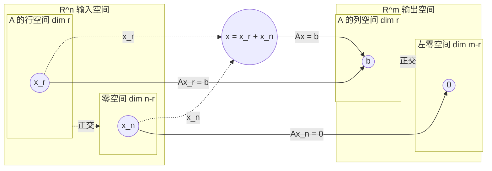

<!--more-->

## Linear subspaces

```mermaid
graph LR
    %% 左侧：R^n 输入空间
    subgraph Rn [R^n 输入空间]
        direction TB
        
        subgraph RowSpace [A 的行空间 dim r]
            direction TB
            xr((x_r))
        end
        
        subgraph NullSpace [零空间 dim n-r]
            direction TB
            xn((x_n))
        end
        
        %% 空间正交关系
        RowSpace -.->|正交| NullSpace
    end

    %% 表示解的合成 x = x_r + x_n
    x((x = x_r + x_n))
    
    %% 虚线表示向量的分解与合成
    xr -.->|x_r| x
    xn -.->|x_n| x

    %% 右侧：R^m 输出空间
    subgraph Rm [R^m 输出空间]
        direction TB
        
        subgraph ColSpace [A 的列空间 dim r]
            direction TB
            b((b))
        end
        
        subgraph LeftNull [左零空间 dim m-r]
            direction TB
            zero((0))
        end
        
        %% 空间正交关系
        ColSpace -.->|正交| LeftNull
    end

    %% 矩阵 A 的映射箭头
    xr -->|Ax_r = b| b
    x -->|Ax = b| b
    xn -->|Ax_n = 0| zero
```
E.g.

$$
A=\begin{pmatrix}
1 & 1 & 4 \\
5 & 1 & 4
\end{pmatrix}
$$

$$
U=\begin{pmatrix}
1 & 1 & 4 \\
0 & -4 & -16
\end{pmatrix}
$$

$$
RREF=\begin{pmatrix}
1 & 0 & 0 \\
0 & 1 & 4
\end{pmatrix}
$$

### C(AT)
取RREF的非零行，即C(AT)=(1,0,0)T,(0,1,4)T，dim C(AT)=r(A)=2。 
### N(A)
解Rx=0，取自由变量的向量，即 

$$
Rx=\begin{pmatrix}
1 & 0 & 0 \\
0 & 1 & 4
\end{pmatrix}
\begin{pmatrix}
x_1 \\
x_2 \\
x_3
\end{pmatrix}=0
$$

解得

$$
x=x_3\begin{pmatrix}
0 \\
-4 \\
1
\end{pmatrix}
$$

即N(A)=(0,-4,1)T，dim N(A)=1。 
### C(A)
取A中与RREF主元列相同的列，即 
C(A)=(1,5)T,(1,1)T，dim C(A)=2。 
### N(AT)
解ATy=0，取自由变量的向量，即 

$$
A^Ty=\begin{pmatrix}
1 & 5 \\
1 & 1 \\
4 & 4
\end{pmatrix}
\begin{pmatrix}
y_1 \\
y_2
\end{pmatrix}=0
$$

$$
R'y=\begin{pmatrix}
1 & 0 \\
0 & 1 \\
0 & 0
\end{pmatrix}
\begin{pmatrix}
y_1 \\
y_2
\end{pmatrix}=0
$$

解得y1=y2=0，即N(AT)=(0,0)T，dim N(AT)=0。

---

## Gram–Schmidt orthogonalization

$$
\eta_j = \frac{A_j}{\|A_j\|}
\qquad
A_j = \alpha_j - \sum_{i=1}^{j-1} (\eta_i^T \alpha_j)\eta_i,
$$

E.g.

存在矩阵A=(α1,α2,α3)，α1=(1,0,1)T，α2=(1,0,0)T，α3=(2,1,0)T 

$$
\begin{aligned}
\eta_1
&= \frac{\alpha_1 - \sum_{i=1}^{1-1} (\eta_i^T \alpha_1)\eta_i}
{\left\| \alpha_1 - \sum_{i=1}^{1-1} (\eta_i^T \alpha_1)\eta_i \right\|} \\
&= \frac{(1,0,1)^T - 0}{\| (1,0,1)^T - 0 \|} \\
&= \frac{(1,0,1)^T}{\sqrt{2}} \\
&= \left( \frac{1}{\sqrt{2}},\ 0,\ \frac{1}{\sqrt{2}} \right)^T .
\end{aligned}
$$

$$
\begin{aligned}
\eta_2
&= \frac{\alpha_2 - \sum_{i=1}^{2-1} (\eta_i^T \alpha_2)\eta_i}
{\left\| \alpha_2 - \sum_{i=1}^{2-1} (\eta_i^T \alpha_2)\eta_i \right\|} \\
&= \frac{(1,0,0)^T - \sum_{i=1}^{1} (\eta_i^T (1,0,0)^T)\eta_i}
{\left\| (1,0,0)^T - \sum_{i=1}^{1} (\eta_i^T (1,0,0)^T)\eta_i \right\|} \\
&= \frac{(1,0,0)^T - (\eta_1^T (1,0,0)^T)\eta_1}
{\left\| (1,0,0)^T - (\eta_1^T (1,0,0)^T)\eta_1 \right\|} \\
&= \frac{(1,0,0)^T - \frac{1}{\sqrt{2}}\left(\frac{1}{\sqrt{2}},0,\frac{1}{\sqrt{2}}\right)^T}
{\left\| (1,0,0)^T - \frac{1}{\sqrt{2}}\left(\frac{1}{\sqrt{2}},0,\frac{1}{\sqrt{2}}\right)^T \right\|} \\
&= \frac{\left(\frac{1}{2},0,-\frac{1}{2}\right)^T}
{\left\| \left(\frac{1}{2},0,-\frac{1}{2}\right)^T \right\|} \\
&= \frac{\left(\frac{1}{2},0,-\frac{1}{2}\right)^T}{\frac{1}{\sqrt{2}}} \\
&= \left(\frac{1}{\sqrt{2}},0,-\frac{1}{\sqrt{2}}\right)^T .
\end{aligned}
$$

$$
\begin{aligned}
\eta_3
&= \frac{\alpha_3 - \sum_{i=1}^{3-1} (\eta_i^T \alpha_3)\eta_i}
{\left\| \alpha_3 - \sum_{i=1}^{3-1} (\eta_i^T \alpha_3)\eta_i \right\|} \\
&= \frac{(2,1,0)^T - \sum_{i=1}^{2} (\eta_i^T (2,1,0)^T)\eta_i}
{\left\| (2,1,0)^T - \sum_{i=1}^{2} (\eta_i^T (2,1,0)^T)\eta_i \right\|} \\
&= \frac{(2,1,0)^T - (\eta_1^T (2,1,0)^T)\eta_1 - (\eta_2^T (2,1,0)^T)\eta_2}
{\left\| (2,1,0)^T - (\eta_1^T (2,1,0)^T)\eta_1 - (\eta_2^T (2,1,0)^T)\eta_2 \right\|} \\
&= \frac{(2,1,0)^T - \sqrt{2}\left(\frac{1}{\sqrt{2}},0,\frac{1}{\sqrt{2}}\right)^T - \sqrt{2}\left(\frac{1}{\sqrt{2}},0,-\frac{1}{\sqrt{2}}\right)^T}
{\left\| (2,1,0)^T - \sqrt{2}\left(\frac{1}{\sqrt{2}},0,\frac{1}{\sqrt{2}}\right)^T - \sqrt{2}\left(\frac{1}{\sqrt{2}},0,-\frac{1}{\sqrt{2}}\right)^T \right\|} \\
&= \frac{(2,1,0)^T - (1,0,1)^T - (1,0,-1)^T}
{\left\| (2,1,0)^T - (1,0,1)^T - (1,0,-1)^T \right\|} \\
&= \frac{(0,1,0)^T}{\|(0,1,0)^T\|} \\
&= (0,1,0)^T .
\end{aligned}
$$

则A对应的正交矩阵Q

$$
Q = (\eta_1,\eta_2,\eta_3) = \begin{pmatrix}
\dfrac{1}{\sqrt{2}} & \dfrac{1}{\sqrt{2}} & 0 \\
0 & 0 & 1 \\
\dfrac{1}{\sqrt{2}} & -\dfrac{1}{\sqrt{2}} & 0
\end{pmatrix},
\qquad
Q^T Q = I
$$
